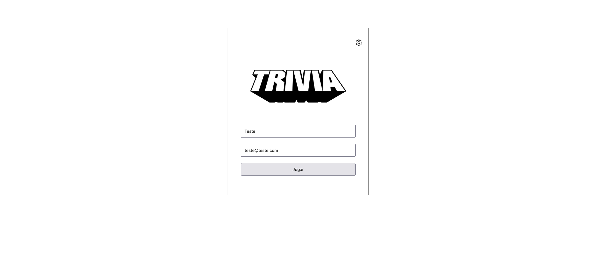
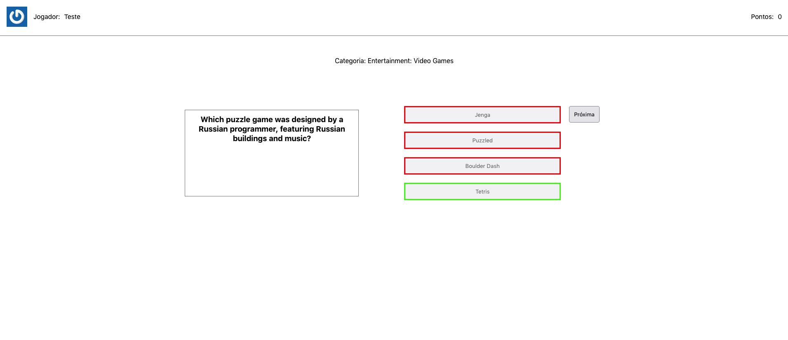

### Sobre o Projeto
Fazendo o uso de Metologias Ágeis, esse terceiro projeto em grupo da Trybe, tinha como objetivo criar um jogo de perguntas e respostas utilizando nossos conhecimentos sobre React e Redux.

---

#### Habilidades colocadas em prática.
  - Criar um store Redux em aplicações React

  - Criar reducers no Redux em aplicações React

  - Criar actions no Redux em aplicações React

  - Criar dispatchers no Redux em aplicações React

  - Conectar Redux aos componentes React

  - Criar actions assíncronas na sua aplicação React que faz uso de Redux.

#### Funcionalidades do App:
  - Logar no jogo e, se o email tiver cadastro no site [Gravatar](https://pt.gravatar.com/), ter sua foto associada ao perfil de usuária.
  - Acessar a página referente ao jogo, onde se deverá escolher uma das respostas disponíveis para cada uma das perguntas apresentadas. A resposta deve ser marcada antes do contador de tempo chegar a zero, caso contrário a resposta deverá ser considerada errada.
  - Ser redirecionado, após 5 perguntas respondidas, para a tela de score, onde o texto mostrado depende do número de acertos.
  - Visualizar a página de ranking, se quiser, ao final de cada jogo.
  - Configurar algumas opções para o jogo em uma tela de configuração acessível a partir do cabeçalho do app.

#### Preview

---
#### Para roda-lo localmente:
Clone o repositório e depois rode os seguintes comandos:

1. `npm install`

2. `npm start`
